<div align="center">

# 🏥 MediAgent AI

### Agentic AI Clinical Decision Support Platform

*Transforming hospital triage and clinical decision-making through Multi-Agent AI, intelligent healthcare workflows, and real-time patient analytics.*

<p align="center">


</p>

</div>

---

# 🚀 Live Demo

### 🌐 Streamlit Application

> https://mediagent-ai-pbgsa8rs7dvyyhbpvydtc7.streamlit.app

---

# 📖 Overview

MediAgent AI is an **Agentic AI Clinical Decision Support Platform** designed to assist both patients and healthcare professionals throughout the clinical assessment workflow.

Unlike traditional symptom checkers, MediAgent AI combines a **Multi-Agent AI architecture**, structured medical workflows, real-time analytics, and intelligent clinical reasoning to support hospital triage, patient management, and decision-making.

The platform provides an end-to-end healthcare experience—from patient symptom analysis and emergency detection to doctor workflow management, AI-powered health conversations, lab report interpretation, appointment preparation, and personalized health profiles.

Built using **LangChain**, **Groq Llama**, **Streamlit**, and **SQLite**, MediAgent AI demonstrates how modern AI systems can enhance healthcare workflows while maintaining transparency through explainable recommendations.

---

# ✨ Why MediAgent AI?

Healthcare professionals often spend valuable time collecting patient information, prioritizing cases, reviewing medical histories, and preparing consultations.

MediAgent AI streamlines these tasks by combining multiple intelligent healthcare tools into a single platform.

The system enables:

- 🤖 AI-assisted patient triage
- 🚨 Early emergency identification
- 🏥 Automatic department recommendation
- 👨‍⚕️ Doctor workflow management
- 💊 Drug interaction analysis
- 🧪 AI lab report interpretation
- 💬 Personalized health conversations
- 📊 Hospital analytics
- 📄 PDF report generation
- 📅 Appointment preparation
- 🗂️ Long-term patient health profiles

---

# ⭐ Core Capabilities

## 🩺 Intelligent Patient Triage

- Multi-Agent AI symptom assessment
- Structured patient intake
- Body-area based symptom analysis
- Pain severity assessment
- Duration and onset analysis
- Medical history collection
- Current medication tracking
- Allergy documentation
- AI-generated clinical summary

---

## 🚨 Emergency Detection

- Critical symptom recognition
- Emergency warning generation
- Urgency scoring (1–10)
- AI confidence score
- Explainable triage reasoning
- Safety-focused recommendations

---

## 🏥 Smart Department Routing

Automatically recommends the most appropriate department including:

- Emergency Medicine
- Cardiology
- Neurology
- Pulmonology
- Gastroenterology
- Dermatology
- Orthopedics
- Psychiatry
- Endocrinology
- ENT
- Ophthalmology
- Obstetrics & Gynecology
- General Medicine

---

## 🎙️ Voice-Assisted Symptom Entry

Patients can describe symptoms naturally using voice.

The application uses:

- Speech-to-Text transcription
- AI symptom extraction
- Automatic form population
- Faster patient intake
- Improved accessibility

---

## 📄 AI Clinical Reports

Automatically generates downloadable PDF reports containing:

- Patient details
- Clinical summary
- AI assessment
- Department recommendation
- Severity classification
- Recommended actions
- Emergency warnings
- Timestamped report generation

---

# 🏗️ System Architecture

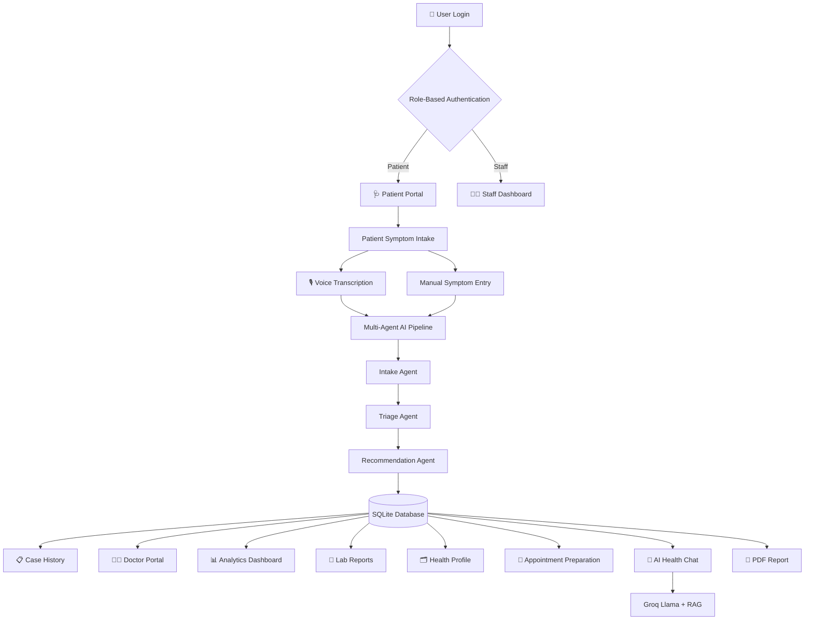

---

# 🤖 Multi-Agent AI Workflow

Unlike traditional symptom checkers that rely on a single AI prompt, MediAgent AI uses a structured **Multi-Agent workflow** where each AI agent performs a specialized task.

| AI Agent | Responsibility |
|----------|----------------|
| 📝 Intake Agent | Validates and structures patient information |
| 🧠 Triage Agent | Determines severity level and urgency |
| 🏥 Department Router | Recommends the appropriate medical department |
| 💡 Recommendation Agent | Generates patient-friendly recommendations |
| 🗄 Database Layer | Stores patient records for future retrieval |
| 💬 AI Health Chat | Uses Retrieval-Augmented Generation (RAG) to answer patient-specific questions |

This modular architecture improves maintainability, explainability, and allows each component to focus on a specific responsibility.

---

# 🔐 Authentication & Role-Based Access

MediAgent AI supports secure role-based authentication for different categories of users.

## 👨‍⚕️ Staff

Hospital staff members can:

- Perform patient triage
- Access the Doctor Portal
- View hospital analytics
- Manage patient cases
- Review AI assessments
- Update patient status

---

## 🧑 Patient

Patients can:

- View their own health profile
- Upload lab reports
- Chat with the AI Health Assistant
- Prepare for appointments
- Download AI-generated reports

---

## 🚀 Demo Mode

To simplify evaluation, the application also provides:

- Staff Demo Account
- Patient Demo Account

allowing recruiters and evaluators to explore the application without registration.

---

# 🛠 Technology Stack

| Category | Technologies |
|-----------|--------------|
| Programming Language | Python 3.11 |
| Frontend | Streamlit |
| AI Framework | LangChain |
| Large Language Model | Groq (Llama 3) |
| Speech Recognition | Groq Whisper |
| Database | SQLite |
| Data Processing | Pandas |
| Data Visualization | Plotly |
| PDF Generation | FPDF2 |
| Environment Management | python-dotenv |
| Drug Database | OpenFDA API |

---

# 📸 Application Walkthrough

## 🔐 Login & Authentication

Secure login with separate Staff and Patient roles along with one-click demo access for quick evaluation.

<p align="center">
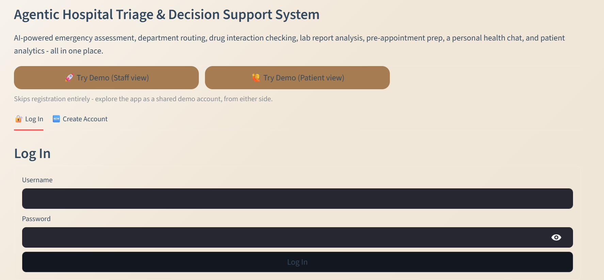
</p>

---

## 🏠 Home Dashboard

The landing page provides a centralized overview of the platform with quick access to all intelligent healthcare modules.

<p align="center">

</p>

---

## 🎙️ Voice-Assisted Symptom Entry

Patients can describe symptoms naturally using voice. The application automatically transcribes the recording and populates the symptom field for faster and more accessible patient intake.

<p align="center">
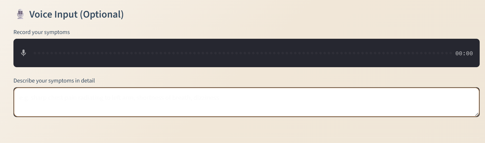
</p>

---

## 📄 AI Generated Clinical Report

After completing the AI assessment, MediAgent AI generates a professional PDF report containing:

- Patient information
- Clinical summary
- Severity classification
- Department recommendation
- Recommended actions
- Emergency warnings

<p align="center">
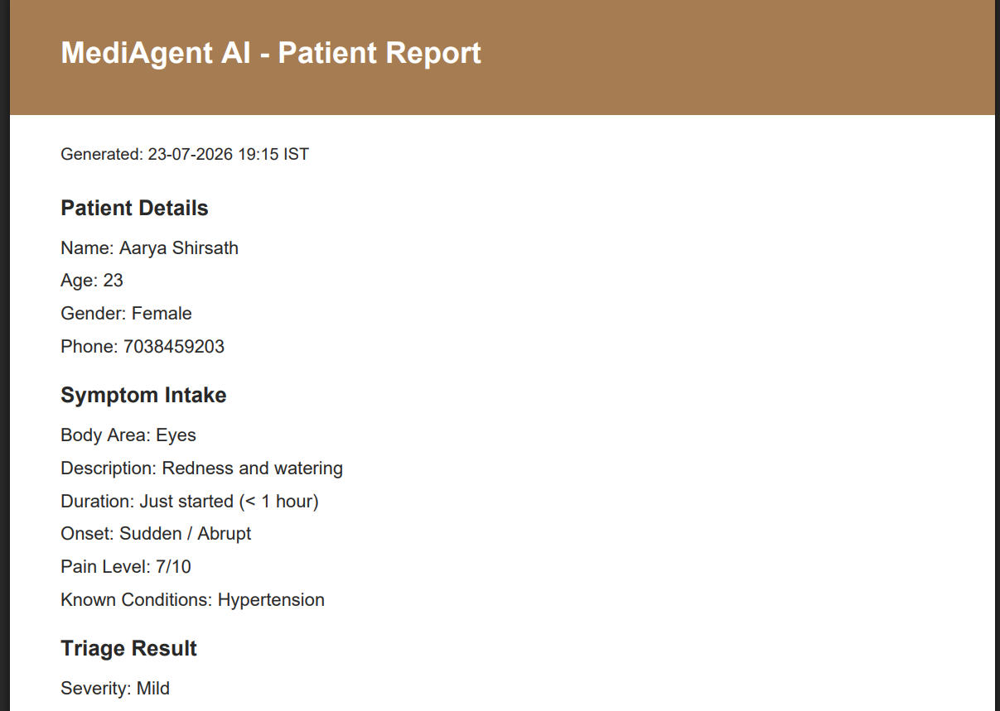
</p>

---

## 📋 Patient Case History

All patient assessments are securely stored in SQLite and can be searched, filtered, reviewed, and managed through the Case History module.

<p align="center">
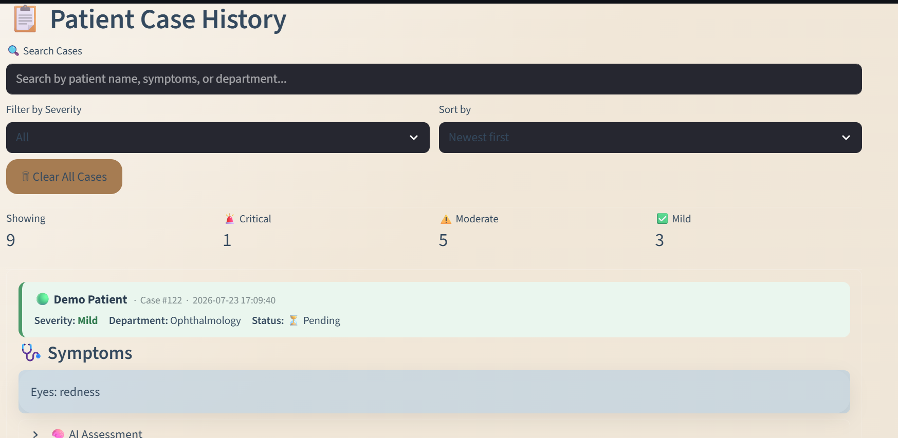
</p>

---

## 📊 Hospital Dashboard

The dashboard provides a high-level operational overview of hospital activity, including case statistics and workflow summaries.

<p align="center">
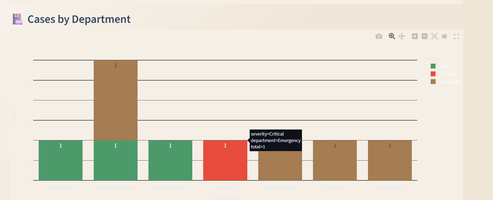
</p>

---

## 📈 Hospital Analytics

Interactive visualizations provide insights into:

- Case trends
- Department workload
- Severity distribution
- Operational metrics
- Hospital performance

<p align="center">
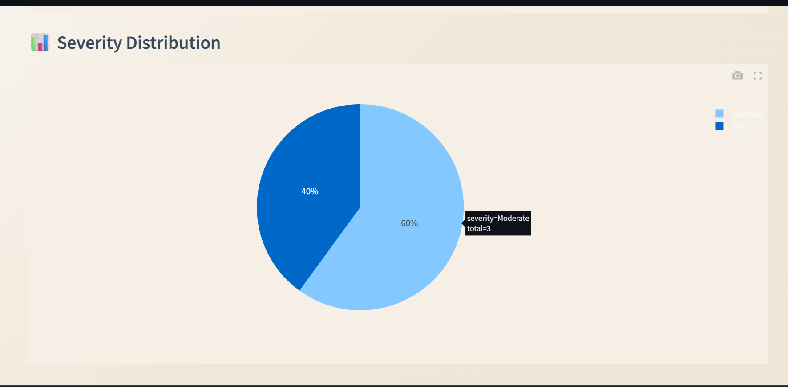
</p>

---

## 👨‍⚕️ Doctor Portal

The Doctor Portal provides healthcare professionals with a centralized workspace to monitor, prioritize, and manage patient cases.

### Features

- 📌 Priority-based patient queue
- 🚨 Critical case highlighting
- ⏳ Pending / In Progress / Resolved workflow
- 📝 Clinical notes
- 🏥 Department assignment
- 📊 Real-time case statistics

<p align="center">
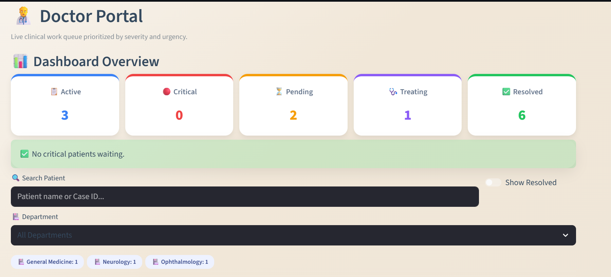
</p>

---

## 💊 Drug Interaction Checker

The Drug Interaction Checker helps identify potential interactions between medications using the **OpenFDA API** and AI-powered explanations.

### Features

- 🔍 Live OpenFDA lookup
- ⚠️ Severity classification
- 🧠 AI-generated explanation
- 💡 Patient-friendly guidance

<p align="center">
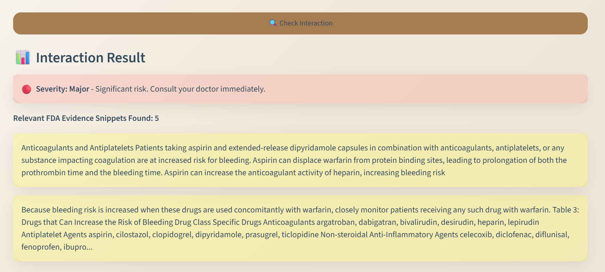
</p>

---

## 🧪 AI Lab Report Analysis

Patients can upload laboratory reports for intelligent interpretation.

The AI extracts relevant clinical information and generates an easy-to-understand summary to assist patients before consulting a healthcare professional.

### Features

- 📄 PDF/Image upload
- 🔍 Automatic text extraction
- 🤖 AI-powered interpretation
- 📈 Historical report storage
- 📊 Trend analysis

<p align="center">
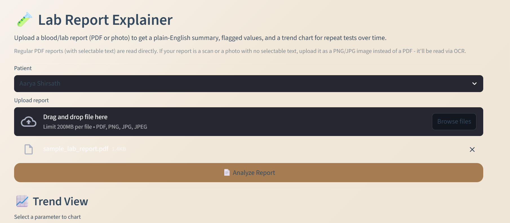
</p>

---

## 📅 Appointment Preparation

Before visiting a doctor, patients receive an AI-generated appointment summary based on previous medical history.

This helps both patients and healthcare professionals make consultations more efficient.

### Includes

- Recent symptoms
- Previous AI assessments
- Historical lab reports
- Existing medical conditions
- Suggested discussion points

<p align="center">
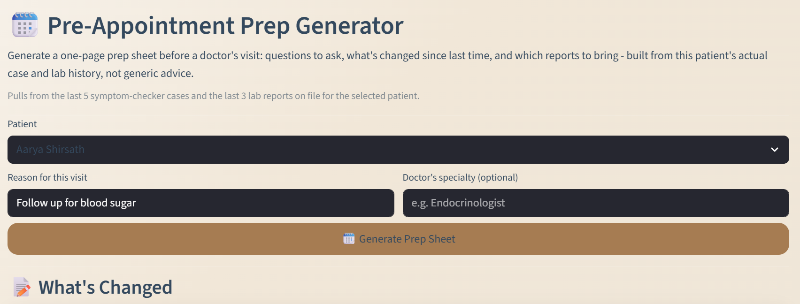
</p>

---

## 💬 AI Health Chat

The AI Health Chat provides contextual answers using the patient's own medical history through Retrieval-Augmented Generation (RAG).

Instead of giving generic responses, the assistant considers previous cases, lab reports, and health profile information.

### Features

- 🧠 Retrieval-Augmented Generation (RAG)
- 📋 Context-aware responses
- 📄 Previous report retrieval
- 👤 Personalized healthcare conversations

<p align="center">
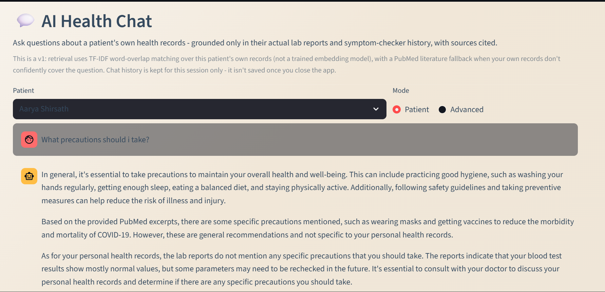
</p>

---

## 🗂️ Health Profile

Patients can maintain a persistent digital health profile that is automatically reused across different modules.

### Stores

- Personal information
- Medical conditions
- Current medications
- Allergies
- Lifestyle information

<p align="center">
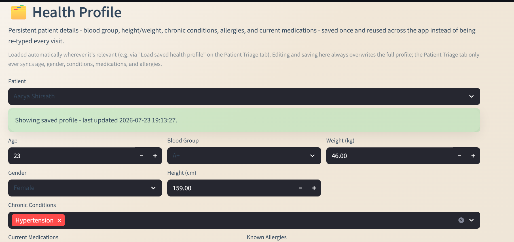
</p>

---

# 📂 Project Structure

```text
mediagent-ai/
│
├── agents/                  # Multi-Agent AI pipeline
│   ├── orchestrator.py
│   └── pipeline.py
│
├── database/                # Database initialization & schema
│
├── data/                    # SQLite database
│
├── tools/                   # Application modules
│   ├── auth_tools.py
│   ├── appointment_prep_tools.py
│   ├── chat_rag_tools.py
│   ├── drug_checker.py
│   ├── health_profile_tools.py
│   ├── lab_report_tools.py
│   ├── save_case.py
│   └── ...
│
├── screenshots/
├── app.py
├── requirements.txt
├── README.md
└── .env
```

---

# 🚀 Installation

Clone the repository

```bash
git clone https://github.com/Aarya0706/mediagent-ai.git
```

Navigate into the project

```bash
cd mediagent-ai
```

Install dependencies

```bash
pip install -r requirements.txt
```

Create a `.env` file

```env
GROQ_API_KEY=YOUR_GROQ_API_KEY
```

Run the application

```bash
streamlit run app.py
```

---

# 🎯 Key Highlights

- 🤖 Agentic AI architecture
- 🏥 Multi-Agent clinical decision support
- 🎙️ Voice-to-text symptom entry
- 🔐 Role-based authentication
- 📄 AI-generated PDF reports
- 👨‍⚕️ Doctor workflow management
- 📊 Hospital analytics dashboard
- 🧪 AI lab report interpretation
- 💬 RAG-powered health assistant
- 💊 Drug interaction analysis
- 📅 Appointment preparation
- 🗂️ Persistent health profiles
- ☁️ Streamlit Cloud deployment

---

# 🔮 Future Enhancements

- 🌍 Multilingual support
- 📱 Mobile-responsive interface
- 🏥 HL7/FHIR interoperability
- 📅 Hospital appointment scheduling
- 🔔 Real-time notifications
- 📈 Predictive hospital workload forecasting
- 🧬 Wearable device integration
- 📤 Electronic Health Record (EHR) integration

---

# ⚠️ Disclaimer

**MediAgent AI is intended for educational and research purposes.**

The platform provides AI-assisted clinical decision support and preliminary recommendations. It is **not a substitute for professional medical advice, diagnosis, or treatment**. Patients should always consult qualified healthcare professionals for medical decisions.

---

# 👩‍💻 Author

## Aarya Shirsath

**B.Tech Computer Science & Engineering**  
**VIT Bhopal University**

### Connect with me

- GitHub: https://github.com/Aarya0706
- LinkedIn: https://www.linkedin.com/in/aarya-shirsath-9b7684340/

---

<div align="center">

### ⭐ If you found this project interesting, consider giving it a star!

**Thank you for visiting MediAgent AI ❤️**

</div>