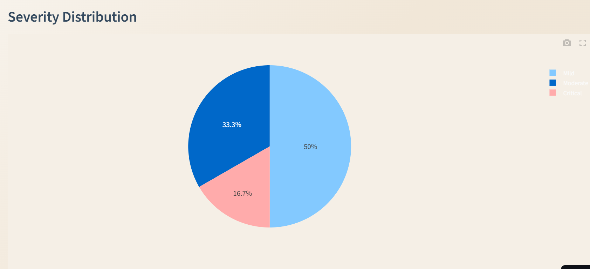
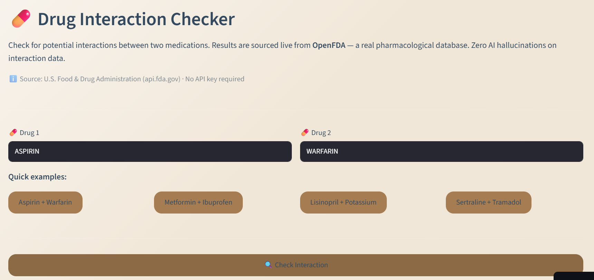

🏥 MediAgent AI

Agentic Hospital Triage & Decision Support System

AI-powered emergency assessment, smart department routing, drug interaction checking, and doctor workflow management — built with a 3-agent LangChain pipeline and live OpenFDA data.

🔗 Live Demo: mediagent-ai-pbgsa8rs7dvyyhbpvydtc7.streamlit.app

Overview

MediAgent AI is a full-stack agentic healthcare triage system. It takes structured patient symptom input through a 3-agent LangChain pipeline (Intake → Triage → Recommendation), classifies severity, routes to the appropriate medical department, generates patient-facing action plans, and checks drug interactions against the FDA's live adverse event database — with zero hallucinations on pharmacological data.

Features

3-Agent LangChain Pipeline — Intake Agent validates input, Triage Agent scores severity and routes department, Recommendation Agent generates patient action plan
Structured Symptom Intake — Body part selector, duration, pain slider (1–10), onset type, known conditions, medications, and allergies
Severity Classification — Mild / Moderate / Critical with urgency score (1–10)
Smart Department Routing — 13 departments including Emergency, Cardiology, Neurology, Psychiatry, Gastroenterology, and more
AI Triage Reasoning — Collapsible expander shows chain-of-thought reasoning from the triage agent
Drug Interaction Checker — Live OpenFDA FAERS database query + Groq LLM plain-English explanation; zero hallucinated interactions
Doctor Portal — Priority-sorted case dashboard with color-coded severity (Critical → Moderate → Mild)
Real-Time Analytics — Cases by department bar chart, severity distribution pie chart, hospital load alert
Patient Case History — SQLite-persisted case log with timestamps
Downloadable Reports — Full patient report including triage reasoning and recommended actions

Tech Stack

LayerTechnologyFrontendStreamlitAI AgentsLangChain + Groq LLaMA3Drug DataOpenFDA API (no key required)DatabaseSQLiteBackendPython 3.11+DeploymentStreamlit Cloud

Architecture

Patient Input (Structured Form)
        │
        ▼
┌─────────────────┐
│  Intake Agent   │  ← Validates & normalises symptom input
└────────┬────────┘
         │
         ▼
┌─────────────────┐
│  Triage Agent   │  ← Scores severity (Critical/Moderate/Mild)
│                 │    Routes to medical department
│                 │    Generates urgency score (1–10)
└────────┬────────┘
         │
         ▼
┌──────────────────────┐
│  Recommendation      │  ← Generates patient action plan
│  Agent               │    Emergency warnings
│                      │    Downloadable report
└──────────────────────┘
         │
         ▼
    SQLite DB  ←→  Doctor Portal  ←→  Analytics Dashboard

Drug Interaction Checker

User inputs Drug 1 + Drug 2
        │
        ▼
OpenFDA FAERS API (live query, no API key)
        │
        ▼
Groq LLaMA3 explains interaction in plain English
        │
        ▼
Severity badge (Major / Moderate / Minor / Unknown)
+ Top adverse reactions + Patient advice

Setup

1. Clone the repo

bashgit clone https://github.com/Aarya0706/mediagent-ai.git
cd mediagent-ai

2. Install dependencies

bashpip install -r requirements.txt

3. Add your Groq API key

bash# Create a .env file
echo 'GROQ_API_KEY="your-key-here"' > .env

Get a free key at console.groq.com

4. Run the app

bashstreamlit run app.py

Project Structure

mediagent-ai/
├── app.py                  # Main Streamlit app (5 tabs)
├── agents/
│   └── pipeline.py         # 3-agent LangChain triage pipeline
├── tools/
│   └── save_case.py        # SQLite case persistence
├── data/
│   └── hospital.db         # SQLite database (gitignored)
├── screenshots/            # App screenshots
├── requirements.txt
└── README.md

### Patient Triage

### Analytics Dashboard  

### Doctor Portal

### Drug Interaction Checker

Author

Aarya Shirsath
B.Tech CSE, VIT Bhopal University
github.com/Aarya0706