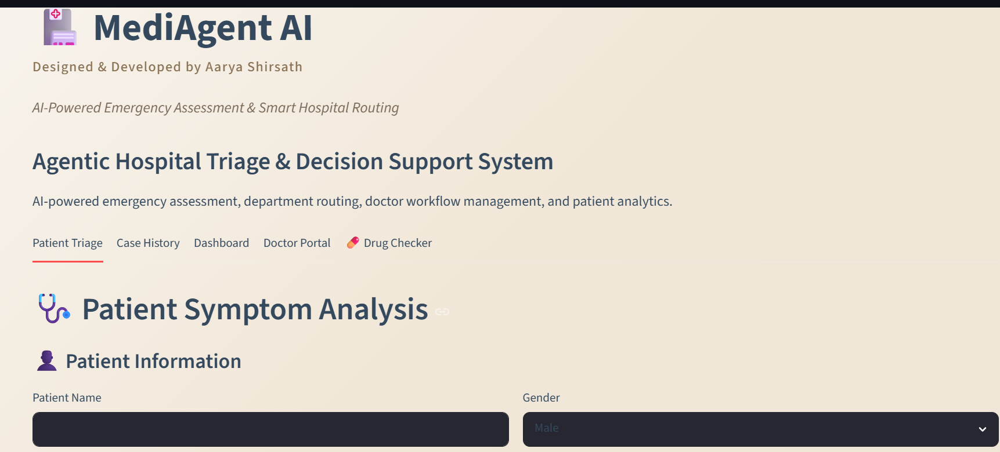
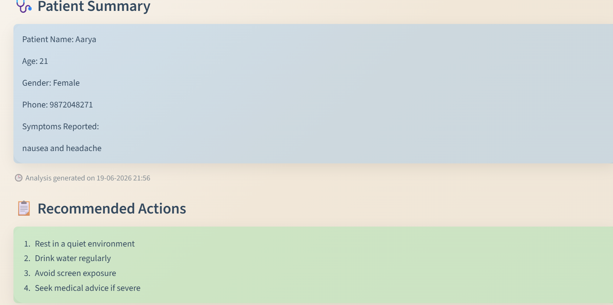
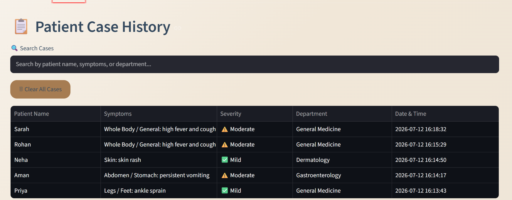
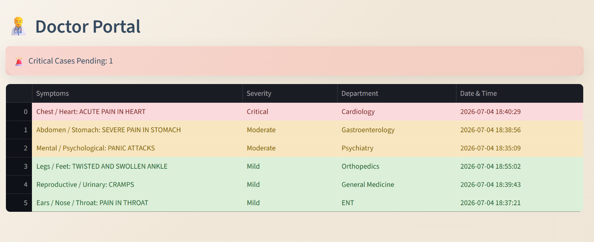

# 🏥 MediAgent AI

AI-Powered Emergency Assessment & Smart Hospital Routing System

## Live Demo

Streamlit App: https://mediagent-ai-pbgsa8rs7dvyyhbpyydtc7.streamlit.app

## Author

Aarya Shirsath
B.Tech CSE, VIT Bhopal University

## Overview

MediAgent AI is an agent-based healthcare triage and decision support system that analyzes patient symptoms, assesses severity, recommends the appropriate medical department, and provides symptom-specific guidance.

## Features

- Patient symptom analysis
- Severity classification (Mild / Moderate / Critical)
- Department recommendation
- Patient case history management
- Doctor portal dashboard
- Symptom-specific recommended actions
- Downloadable patient reports
- SQLite database integration
- Groq LLM powered reasoning
- Streamlit web interface

## Tech Stack

- Python
- Streamlit
- SQLite
- Groq API
- LangChain
- GitHub

Developed the complete AI-powered triage workflow, symptom analysis engine, department routing system, patient history management, and Streamlit-based healthcare dashboard.

## Screenshots

### Home Page

### Patient Summary

### Case History

### Doctor Portal

 