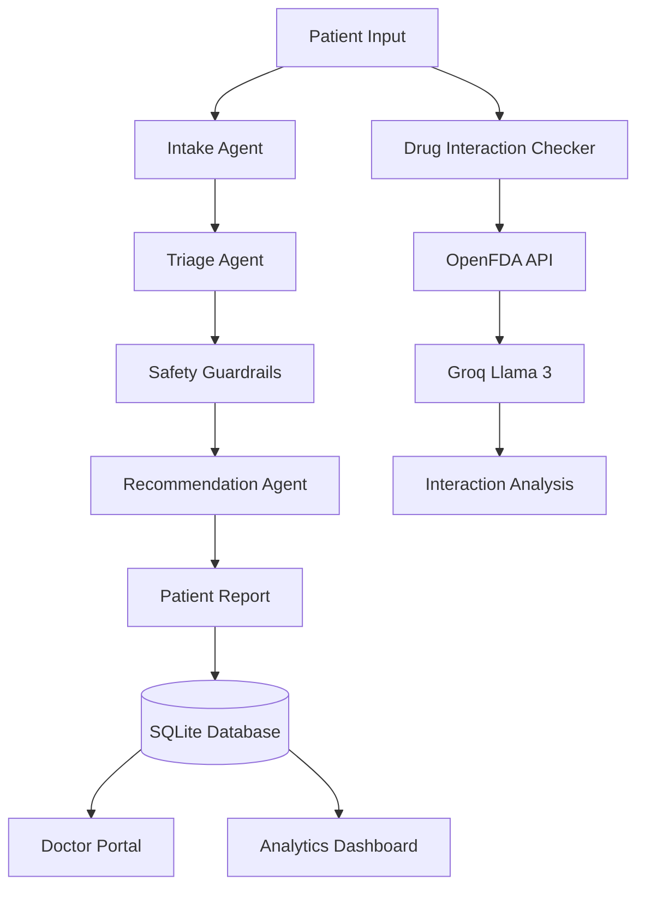
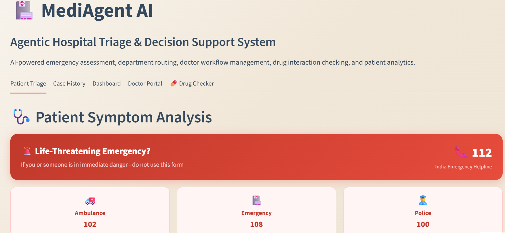
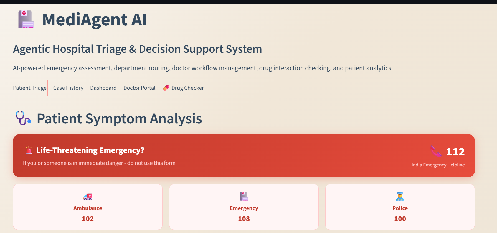
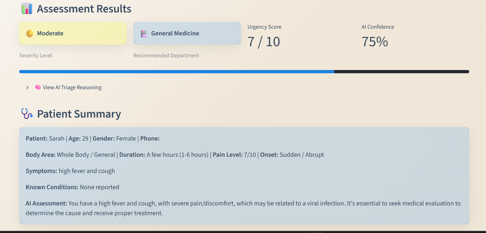

# 🏥 MediAgent AI


## AI-Powered Hospital Triage & Clinical Decision Support System

Intelligent patient triage, emergency detection, department recommendation, drug interaction analysis, and doctor workflow management using a multi-agent AI architecture.

🚀 **Try the Live Application**

https://mediagent-ai-pbgsa8rs7dvyyhbpvydtc7.streamlit.app
---

# 📖 Overview

MediAgent AI is an AI-powered clinical decision support platform that assists patients and healthcare professionals through intelligent symptom assessment, emergency triage, department recommendation, drug interaction analysis, and doctor workflow management.

The system combines a multi-agent AI pipeline built with LangChain and Groq Llama models with deterministic safety guardrails to provide reliable, explainable, and patient-friendly recommendations.

Beyond patient assessment, MediAgent AI also includes a Doctor Portal, searchable patient case history, real-time hospital analytics, downloadable PDF reports, and a live OpenFDA-powered drug interaction checker.

---

# ✨ Features

- 🤖 **Multi-Agent AI Pipeline**
  - Intake Agent
  - Triage Agent
  - Recommendation Agent

- 🩺 **Structured Patient Assessment**
  - Body area selection
  - Pain level
  - Duration
  - Symptom onset
  - Medical history
  - Current medications
  - Allergies

- 🚨 **Emergency Detection**
  - AI-assisted emergency recognition
  - Deterministic safety guardrails
  - Emergency warning system

- 🏥 **Intelligent Department Recommendation**
  - Emergency
  - General Medicine
  - Cardiology
  - Neurology
  - Gastroenterology
  - Dermatology
  - Pulmonology
  - Psychiatry
  - Orthopedics
  - ENT
  - Ophthalmology
  - Obstetrics & Gynecology
  - Endocrinology

- 📊 **Severity Assessment**
  - Mild
  - Moderate
  - Critical
  - Urgency Score (1–10)
  - AI Confidence Score

- 🧠 **Explainable AI**
  - Transparent triage reasoning
  - Patient-friendly recommendations

- 💊 **Drug Interaction Checker**
  - Live OpenFDA integration
  - AI-generated interaction explanation
  - Severity classification
  - Patient guidance

- 📄 **Downloadable PDF Reports**
  - Patient summary
  - AI assessment
  - Recommended actions
  - Emergency warnings

- 👨‍⚕️ **Doctor Portal**
  - Pending / In Progress / Resolved workflow
  - Department filtering
  - Live critical case counter
  - Time since admission

- 📋 **Patient Case History**
  - SQLite database
  - Search by patient name
  - Search by symptoms
  - Search by department

- 📈 **Hospital Analytics Dashboard**
  - Cases over time
  - Department-wise statistics
  - Severity distribution
  - Live hospital status monitoring

---
## ⭐ Key Highlights

- 🤖 Multi-Agent AI architecture using LangChain and Groq Llama 3
- 🩺 Intelligent symptom assessment with structured patient intake
- 🚨 Deterministic safety guardrails for emergency detection
- 🏥 Automatic routing across 13+ medical departments
- 📄 Downloadable PDF clinical reports
- 👨‍⚕️ Doctor Portal with priority-based patient queue
- 📊 Real-time hospital analytics dashboard
- 🔍 Searchable patient case history
- 💊 Live OpenFDA-powered drug interaction checker
- 💾 SQLite database for persistent case management

# 🛠 Tech Stack

| Layer | Technology |
|--------|------------|
| Frontend | Streamlit |
| AI Framework | LangChain |
| LLM | Groq (Llama 3) |
| Backend | Python |
| Database | SQLite |
| Data Analysis | Pandas |
| Data Visualization | Plotly |
| PDF Generation | FPDF |
| Environment | python-dotenv |
| Drug Data | OpenFDA API |
| Deployment | Streamlit Cloud |

---

## 🏗️ System Architecture



---

# 💊 Drug Interaction Workflow

```text
Drug 1 + Drug 2
        │
        ▼
OpenFDA Live Database
        │
        ▼
Groq Llama Analysis
        │
        ▼
Severity Classification
        │
        ▼
Patient-Friendly Explanation
```

---

## 📂 Project Structure

```text
mediagent-ai/
│
├── agents/
│   ├── orchestrator.py
│   └── pipeline.py
│
├── database/
│   ├── db.py
│   └── schema.py
│
├── tools/
│   ├── department_router.py
│   ├── emergency_checker.py
│   └── save_case.py
│
├── screenshots/
│
├── app.py
├── README.md
├── requirements.txt
├── runtime.txt
└── .gitignore
```

---

# 🚀 Installation

### Clone Repository

```bash
git clone https://github.com/Aarya0706/mediagent-ai.git
cd mediagent-ai
```

### Install Dependencies

```bash
pip install -r requirements.txt
```

### Create Environment File

Create a `.env` file:

```env
GROQ_API_KEY=your_groq_api_key
```

### Run

```bash
streamlit run app.py
```

---

## 📸 Application Screenshots

### 🏠 Home Page

| Main Interface | Voice Input |
|---|---|
|  |  |

---

### 🩺 AI Assessment



---

### 📋 Patient Case History


---

### 📊 Hospital Analytics Dashboard


---

### 👨‍⚕️ Doctor Portal


---

### 💊 Drug Interaction Checker


---

# ⭐ Key Highlights

- Multi-agent AI architecture using LangChain and Groq
- Intelligent clinical triage and department recommendation
- Emergency symptom detection with deterministic safety guardrails
- Live OpenFDA drug interaction lookup
- Explainable AI recommendations
- Downloadable PDF reports
- Doctor workflow management
- Searchable patient case history
- Interactive analytics dashboard
- SQLite-backed patient records
- Streamlit Cloud deployment

---
## 🚀 Future Improvements

- 🎤 Speech-to-text symptom entry
- 🌍 Multilingual support
- 📅 Appointment booking integration
- 📱 Mobile-responsive interface
- 🧠 Retrieval-Augmented Generation (RAG) for clinical guidelines
- 🏥 FHIR/HL7 healthcare interoperability
- 🔐 User authentication and role-based access
- 📈 Predictive hospital workload analytics

# 👩‍💻 Author

**Aarya Shirsath**

B.Tech Computer Science & Engineering  
VIT Bhopal University

GitHub: https://github.com/Aarya0706