<div align="center">

# 🏥 MediAgent AI

### Agentic AI Clinical Decision Support Platform

*Multi-agent triage with deterministic safety guardrails, patient-scoped RAG, runtime observability, and automated evaluation — measured, not just claimed.*

<p align="center">


</p>

</div>

---

# 🚀 Live Demo

### 🌐 Streamlit Application

> https://mediagent-ai-pbgsa8rs7dvyyhbpvydtc7.streamlit.app

---

# 📖 Overview

MediAgent AI is an **agentic AI clinical workflow platform**: a 3-agent LangChain pipeline (Intake → Triage → Recommendation) sits behind deterministic safety guardrails, patient-scoped RAG retrieval, per-run observability, and regression-tested evaluation suites — the parts of an AI system that are usually the hardest to get right and the easiest to skip in a portfolio project.

The clinical feature set (symptom triage, emergency detection, doctor workflow, AI-powered health chat, lab report interpretation, appointment prep, health profiles) is the surface. What backs it: safety logic that runs *after* the LLM and can't be talked out of its rules, retrieval that's evaluated against labeled cases instead of eyeballed, and telemetry on every pipeline run rather than a black box.

Built using **LangChain**, **Groq (OpenAI GPT-OSS)**, **Streamlit**, and **SQLite** — see the **Evaluation** section below for the numbers these claims are backed by, and **Security Model & Limitations** for what's explicitly still scoped out.

---

# ✨ Why MediAgent AI?

Healthcare professionals often spend valuable time collecting patient information, prioritizing cases, reviewing medical histories, and preparing consultations.

MediAgent AI streamlines these tasks by combining multiple intelligent healthcare tools into a single platform.

The system enables:

- 🤖 AI-assisted patient triage
- 🚨 Early emergency identification
- 🏥 Automatic department recommendation
- 👨‍⚕️ Doctor workflow management
- 💊 Drug interaction analysis
- 🧪 AI lab report interpretation
- 💬 Personalized health conversations
- 📊 Hospital analytics
- 📄 PDF report generation
- 📅 Appointment preparation
- 🗂️ Long-term patient health profiles

---

# 🧪 Evaluation

AI quality claims in this project are backed by regression suites rather than
asserted:

- A curated **triage evaluation suite** (`evaluation/evaluate_triage.py`,
  `evaluation/triage_cases.json`) checks severity/department accuracy and
  safety-critical behavior (emergency recall) against 60 fixed cases,
  including cases specifically designed to probe the guardrail logic for
  edge cases.
- A **RAG evaluation suite** (`evaluation/evaluate_rag.py`,
  `evaluation/rag_cases.json`) checks retrieval quality for the AI Health
  Chat — direct-match, clinical-synonym, multi-chunk-ranking, and
  no-confident-match cases — against 13 labeled cases, with no LLM calls
  required to run it.

### Latest results

**Triage** (60 cases, full run including live Groq calls):

| Metric | Value |
|---|---|
| Severity exact match | 78.9% |
| Department exact match | 82.5% |
| Department acceptable match | 91.2% |
| Emergency detection recall | 94.4% |
| Emergency detection precision | 100.0% |
| Invalid-input handling accuracy | 100.0% |

**RAG retrieval** (13 cases, no LLM calls — runs in seconds):

| Metric | Value |
|---|---|
| Retrieval recall | 100.0% |
| Confidence-gate accuracy | 100.0% |
| Precision | 100.0% |

Numbers change as the suites grow and the models/prompts evolve — see
`evaluation/results/` for the full history and `evaluation/README.md` for
methodology.

**A finding, not just a score:** the triage suite includes cases
specifically designed to probe `apply_triage_guardrails()` (the
deterministic rule layer that runs immediately after the LLM), and it
caught a real gap — a textbook surgical emergency (appendicitis) that
doesn't match any of the ~20 hardcoded red-flag phrases gets silently
downgraded from the LLM's correct "Critical" call to "Moderate" *before*
`apply_safety_gate()` (the final structural check) ever sees a "Critical"
severity to act on. It's an open, documented failure rather than something
smoothed over — see the "Known limitation" note in the latest
`evaluation/results/report_*.md`.

Reproduce locally:

```bash
python evaluation/evaluate_triage.py --dry-run   # validates the case file, no API calls
python evaluation/evaluate_triage.py             # full run, needs GROQ_API_KEY
python evaluation/evaluate_rag.py                # retrieval-only, no API key needed
```

---

# ⭐ Core Capabilities

## 🩺 Intelligent Patient Triage

- Multi-Agent AI symptom assessment
- Structured patient intake
- Body-area based symptom analysis
- Pain severity assessment
- Duration and onset analysis
- Medical history collection
- Current medication tracking
- Allergy documentation
- AI-generated clinical summary

---

## 🚨 Emergency Detection

- Critical symptom recognition
- Emergency warning generation
- Urgency scoring (1–10)
- AI confidence score
- Explainable triage reasoning
- Safety-focused recommendations

---

## 🏥 Smart Department Routing

Automatically recommends the most appropriate department including:

- Emergency Medicine
- Cardiology
- Neurology
- Pulmonology
- Gastroenterology
- Dermatology
- Orthopedics
- Psychiatry
- Endocrinology
- ENT
- Ophthalmology
- Obstetrics & Gynecology
- General Medicine

---

## 🎙️ Voice-Assisted Symptom Entry

Patients can describe symptoms naturally using voice.

The application uses:

- Speech-to-Text transcription
- AI symptom extraction
- Automatic form population
- Faster patient intake
- Improved accessibility

---

## 📄 AI Clinical Reports

Automatically generates downloadable PDF reports containing:

- Patient details
- Clinical summary
- AI assessment
- Department recommendation
- Severity classification
- Recommended actions
- Emergency warnings
- Timestamped report generation

---

# 🏗️ System Architecture

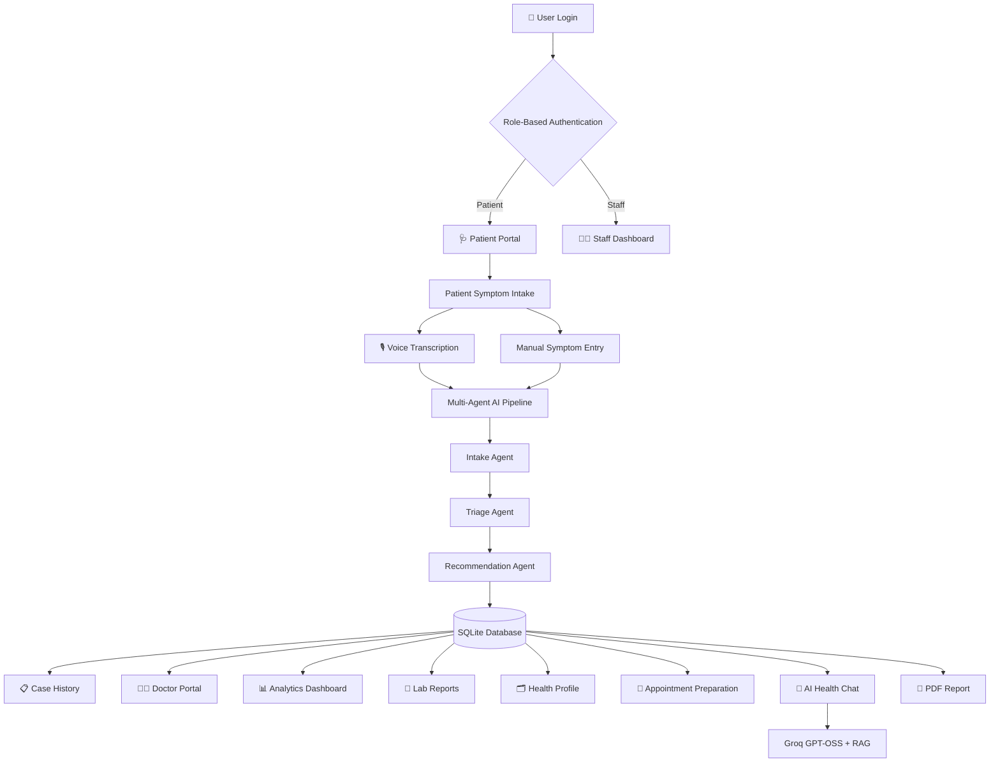
```mermaid
flowchart TD

A[👤 User Login] --> B{Role-Based Authentication}

B -->|Patient| C[🩺 Patient Portal]
B -->|Staff| D[👨‍⚕️ Staff Dashboard]

C --> E[Patient Symptom Intake]

E --> F[🎙️ Voice Transcription]
E --> G[Manual Symptom Entry]

F --> H[Multi-Agent AI Pipeline]
G --> H

H --> I[Intake Agent]
I --> J[Triage Agent]
J --> K[Recommendation Agent]

K --> L[(SQLite Database)]

L --> M[📋 Case History]
L --> N[👨‍⚕️ Doctor Portal]
L --> O[📊 Analytics Dashboard]
L --> P[🧪 Lab Reports]
L --> Q[🗂️ Health Profile]
L --> R[📅 Appointment Preparation]
L --> S[💬 AI Health Chat]

S --> T[Groq GPT-OSS + RAG]

L --> U[📄 PDF Report]
```

---

# 🤖 Multi-Agent AI Workflow

Unlike traditional symptom checkers that rely on a single AI prompt, MediAgent AI uses a structured **Multi-Agent workflow** where each AI agent performs a specialized task.

| AI Agent | Responsibility |
|----------|----------------|
| 📝 Intake Agent | Validates and structures patient information |
| 🧠 Triage Agent | Determines severity level and urgency |
| 🏥 Department Router | Recommends the appropriate medical department |
| 💡 Recommendation Agent | Generates patient-friendly recommendations |
| 🛡️ Safety Gate | Deterministic second layer (`agents/safety_gate.py`) that runs after every agent, independent of the LLM, and guarantees an emergency case always carries an explicit flag and warning |
| 🔎 Observability | Every agent call is timed, logged (latency, status, token usage — never symptom/patient content), and surfaced in the Doctor Portal (`agents/observability.py`) |
| 🗄 Database Layer | Stores patient records for future retrieval |
| 💬 AI Health Chat | Uses Retrieval-Augmented Generation (RAG) to answer patient-specific questions |

This modular architecture improves maintainability, explainability, and allows each component to focus on a specific responsibility.

---

# 🔐 Authentication & Role-Based Access

MediAgent AI supports secure role-based authentication for different categories of users.

## 👨‍⚕️ Staff

Hospital staff members can:

- Perform patient triage
- Access the Doctor Portal
- View hospital analytics
- Manage patient cases
- Review AI assessments
- Update patient status

---

## 🧑 Patient

Patients can:

- View their own health profile
- Upload lab reports
- Chat with the AI Health Assistant
- Prepare for appointments
- Download AI-generated reports

---

## 🚀 Demo Mode

To simplify evaluation, the application also provides:

- Staff Demo Account
- Patient Demo Account

allowing recruiters and evaluators to explore the application without registration.

---

# ⚡ Demo in 3 Minutes

For recruiters and reviewers short on time:

1. **Open the [live demo](https://mediagent-ai-pbgsa8rs7dvyyhbpvydtc7.streamlit.app)** and log in with the Staff or Patient demo account shown on the login screen — no registration needed.
2. **Submit a symptom** on the Patient Triage tab (try something specific, e.g. "sudden chest pain radiating to my left arm, shortness of breath"). Watch the Multi-Agent pipeline run — Intake → Triage → Recommendation — and note the severity, department, urgency score, and emergency warning if applicable. Download the generated PDF report.
3. **Switch to a Staff login** and open the **Doctor Portal** tab: the case you just submitted appears in the work queue, sorted by severity. Expand **"🔎 Agent Observability"** to see real latency/success-rate telemetry for the pipeline run you just triggered.
4. **Try the AI Health Chat** tab as the patient: ask a question about the case you just submitted (e.g. "what did you recommend for my chest pain?") and note the response cites its source — it's grounded in your own record, not a generic answer.
5. **Check the evaluation suite**: `evaluation/results/` in the repo has the full history of triage and RAG accuracy runs — the numbers in the Evaluation section above aren't asserted, they're generated by running `evaluation/evaluate_triage.py` and `evaluation/evaluate_rag.py` against fixed case sets.

---

# 🔒 Security Model & Limitations

**What's implemented:**

- Passwords are hashed with PBKDF2-HMAC-SHA256 and a random per-user salt (`tools/auth_tools.py`) — never stored in plaintext.
- Patient data access is enforced at the **query level**, not just hidden in the UI: every read is filtered by `patient_name` in SQL, and a patient-role login can never retrieve another patient's records even if the UI is bypassed (`tools/authorization.py`, covered by `tests/test_authorization.py`).
- Secrets (`GROQ_API_KEY`, etc.) are read from environment variables / `.env`, which is git-ignored — never committed or hardcoded.
- Uploaded lab report files are validated by type before processing (`tools/lab_report_tools.py`).
- All SQL is parameterized throughout the codebase — no string-interpolated queries.

**Known limitations (documented, not hidden):**

- **Identity model**: every table keys off `patient_name` (a free-text, case-insensitive string) rather than a real `patient_id` foreign key into a dedicated `patients` table — see the note at the top of `database/schema.py` for why this is a deliberately scoped-out normalization gap rather than something silently left unconsidered. Two patients sharing a name would collide under the current model.
- **Not production-ready for real PHI**: this is an educational/portfolio project. There's no encryption at rest, no audit logging of individual record access, and no HIPAA/data-protection compliance review. Do not use it to store real patient data.
- **Single-instance SQLite**: no built-in high-availability, replication, or concurrent-write scaling — fine for a demo, not for a multi-tenant production deployment.
- **AI confidence scores are not clinically validated** — they reflect model self-reported confidence, not a calibrated clinical probability. See the Disclaimer section below.

---

# 🛠 Technology Stack

| Category | Technologies |
|-----------|--------------|
| Programming Language | Python 3.11 |
| Frontend | Streamlit |
| AI Framework | LangChain |
| Large Language Model | Groq — OpenAI GPT-OSS (`openai/gpt-oss-20b`, override to `openai/gpt-oss-120b` via `GROQ_MODEL`) |
| Speech Recognition | Groq Whisper |
| Database | SQLite |
| Data Processing | Pandas |
| Data Visualization | Plotly |
| PDF Generation | FPDF2 |
| Environment Management | python-dotenv |
| Drug Database | OpenFDA API |

---

# 📸 Application Walkthrough

## 🔐 Login & Authentication

Secure login with separate Staff and Patient roles along with one-click demo access for quick evaluation.

<p align="center">
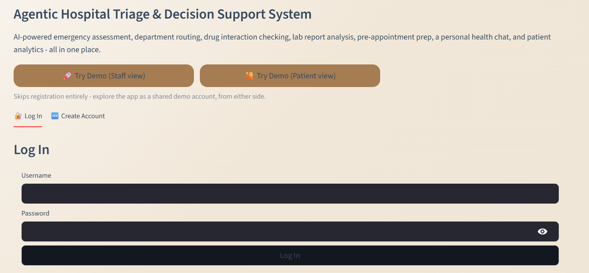
</p>

---

## 🏠 Home Dashboard

The landing page provides a centralized overview of the platform with quick access to all intelligent healthcare modules.

<p align="center">
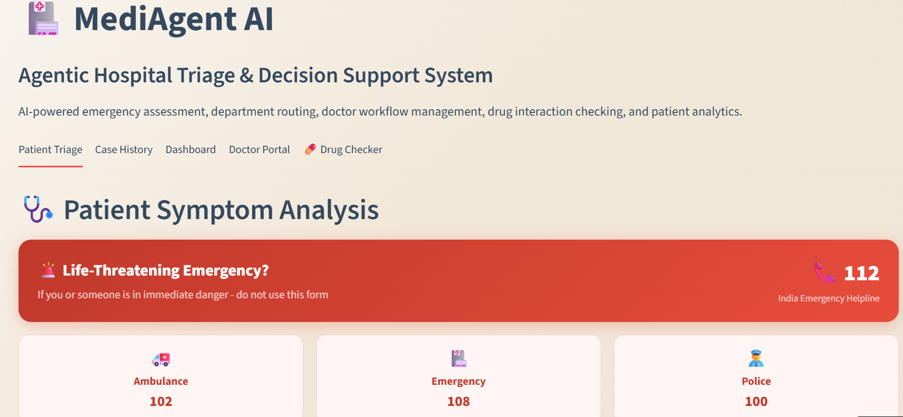
</p>

---

## 🎙️ Voice-Assisted Symptom Entry

Patients can describe symptoms naturally using voice. The application automatically transcribes the recording and populates the symptom field for faster and more accessible patient intake.

<p align="center">
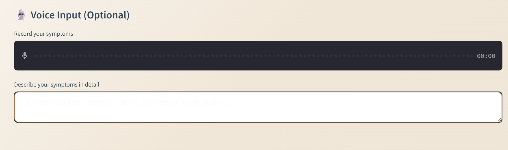
</p>

---

## 📄 AI Generated Clinical Report

After completing the AI assessment, MediAgent AI generates a professional PDF report containing:

- Patient information
- Clinical summary
- Severity classification
- Department recommendation
- Recommended actions
- Emergency warnings

<p align="center">
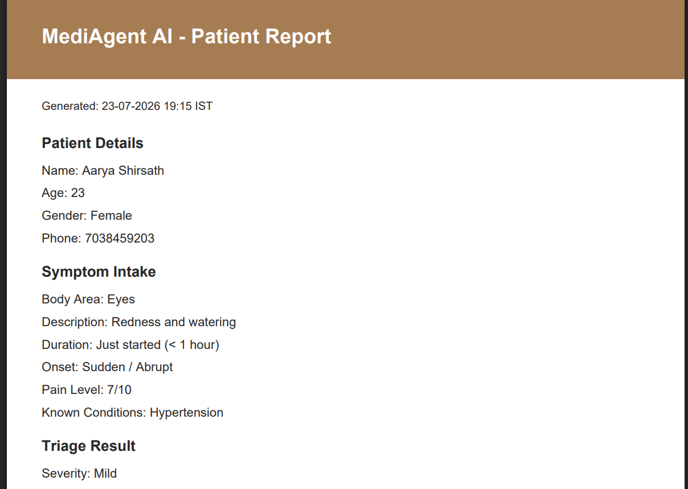
</p>

---

## 📋 Patient Case History

All patient assessments are securely stored in SQLite and can be searched, filtered, reviewed, and managed through the Case History module.

<p align="center">
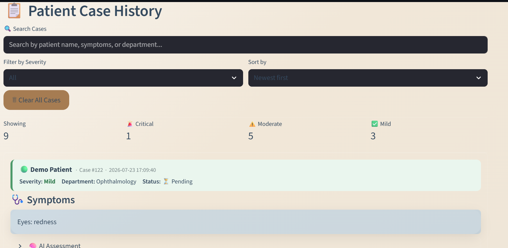
</p>

---

## 📊 Hospital Dashboard

The dashboard provides a high-level operational overview of hospital activity, including case statistics and workflow summaries.

<p align="center">
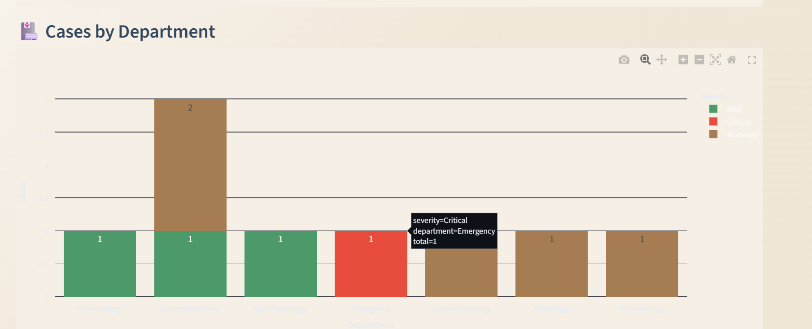
</p>

---

## 📈 Hospital Analytics

Interactive visualizations provide insights into:

- Case trends
- Department workload
- Severity distribution
- Operational metrics
- Hospital performance

<p align="center">
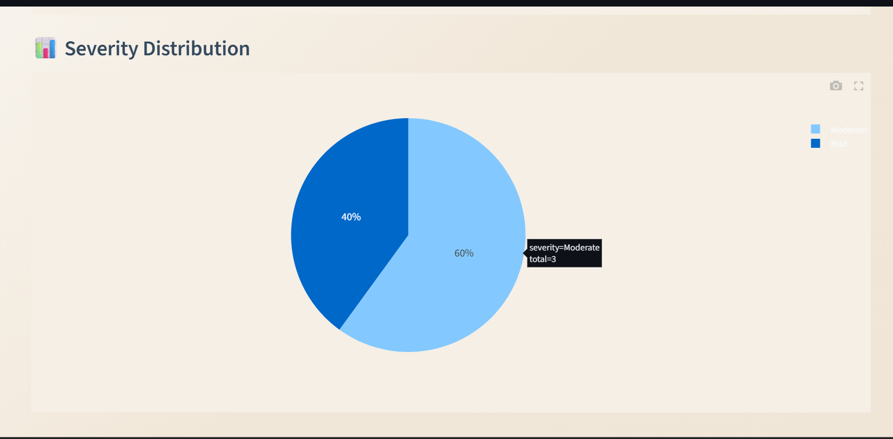
</p>

---

## 👨‍⚕️ Doctor Portal

The Doctor Portal provides healthcare professionals with a centralized workspace to monitor, prioritize, and manage patient cases.

### Features

- 📌 Priority-based patient queue
- 🚨 Critical case highlighting
- ⏳ Pending / In Progress / Resolved workflow
- 📝 Clinical notes
- 🏥 Department assignment
- 📊 Real-time case statistics

<p align="center">
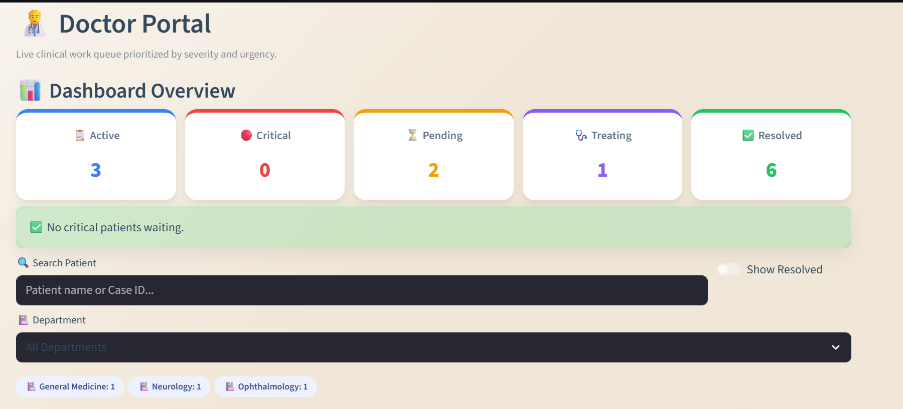
</p>

---

## 💊 Drug Interaction Checker

The Drug Interaction Checker helps identify potential interactions between medications using the **OpenFDA API** and AI-powered explanations.

### Features

- 🔍 Live OpenFDA lookup
- ⚠️ Severity classification
- 🧠 AI-generated explanation
- 💡 Patient-friendly guidance

<p align="center">
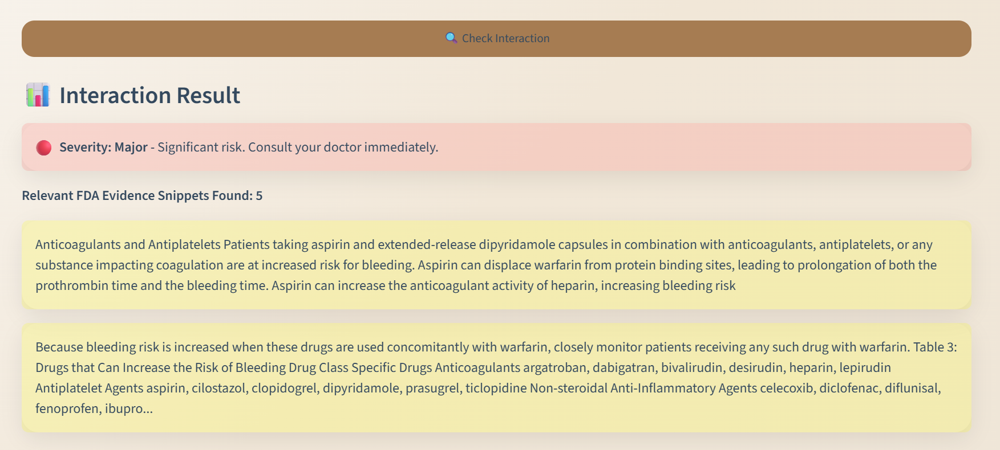
</p>

---

## 🧪 AI Lab Report Analysis

Patients can upload laboratory reports for intelligent interpretation.

The AI extracts relevant clinical information and generates an easy-to-understand summary to assist patients before consulting a healthcare professional.

### Features

- 📄 PDF/Image upload
- 🔍 Automatic text extraction
- 🤖 AI-powered interpretation
- 📈 Historical report storage
- 📊 Trend analysis

<p align="center">
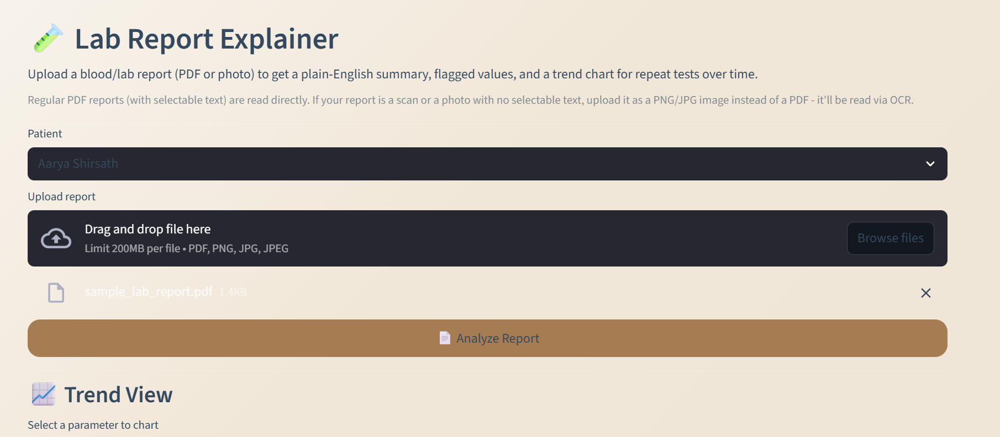
</p>

---

## 📅 Appointment Preparation

Before visiting a doctor, patients receive an AI-generated appointment summary based on previous medical history.

This helps both patients and healthcare professionals make consultations more efficient.

### Includes

- Recent symptoms
- Previous AI assessments
- Historical lab reports
- Existing medical conditions
- Suggested discussion points

<p align="center">
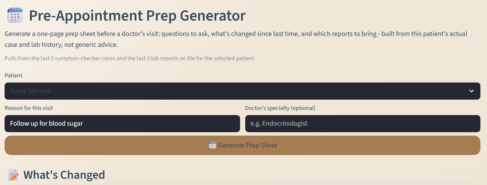
</p>

---

## 💬 AI Health Chat

The AI Health Chat provides contextual answers using the patient's own medical history through Retrieval-Augmented Generation (RAG).

Instead of giving generic responses, the assistant considers previous cases, lab reports, and health profile information.

### Features

- 🧠 Retrieval-Augmented Generation (RAG)
- 📋 Context-aware responses
- 📄 Previous report retrieval
- 👤 Personalized healthcare conversations

### How the RAG flow works

1. **Chunking** — lab report summaries/values and past symptom-checker cases
   are turned into text chunks on the fly (`tools/chat_rag_tools.py`,
   `get_patient_chunks`), each carrying a human-readable source label
   (e.g. `"Lab report from 2026-07-21 (cbc.pdf)"`). No separate ingestion
   pipeline or vector DB — chunks are built fresh per query from data that
   already exists.
2. **Authorization** — chunks are fetched with a `patient_name` filter at the
   SQL level, not just hidden in the UI, so retrieval can never cross into
   another patient's records (see `tests/test_authorization.py`).
3. **Retrieval** — TF-IDF + cosine similarity over just that patient's own
   chunks, with a small hand-picked clinical-synonym expansion (e.g.
   "diabetes" → "blood sugar", "kidney" → "creatinine") so lay terms still
   match clinical vocabulary. A similarity threshold (`min_similarity=0.05`)
   decides whether the match is "confident."
4. **PubMed fallback** — only when nothing in the patient's own records
   clears that confidence bar does the assistant also pull relevant PubMed
   abstracts (free NCBI E-utilities, no API key) as background literature —
   never as a replacement for what the patient's own data does or doesn't
   show.
5. **Grounded generation + citations** — the LLM is instructed to answer
   patient-specific questions *only* from the retrieved excerpts and to cite
   them naturally ("Based on your lab report from...", "Per PubMed
   (PMID:...)"); general (non-patient-specific) questions are clearly
   labeled as general information. The chat UI displays the source list
   under each answer.

Retrieval quality is evaluated in `evaluation/rag_cases.json` +
`evaluation/evaluate_rag.py` — see `evaluation/README.md`.

<p align="center">
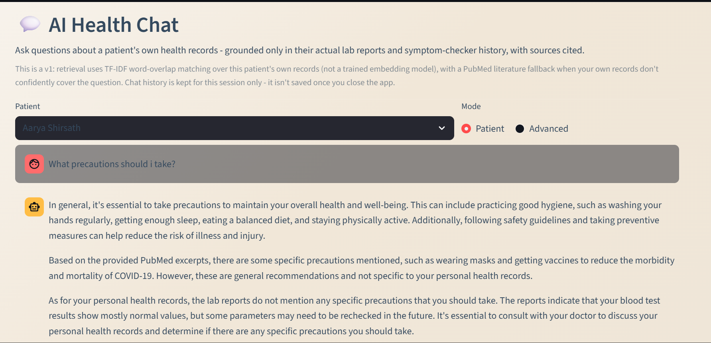
</p>

---

## 🗂️ Health Profile

Patients can maintain a persistent digital health profile that is automatically reused across different modules.

### Stores

- Personal information
- Medical conditions
- Current medications
- Allergies
- Lifestyle information

<p align="center">
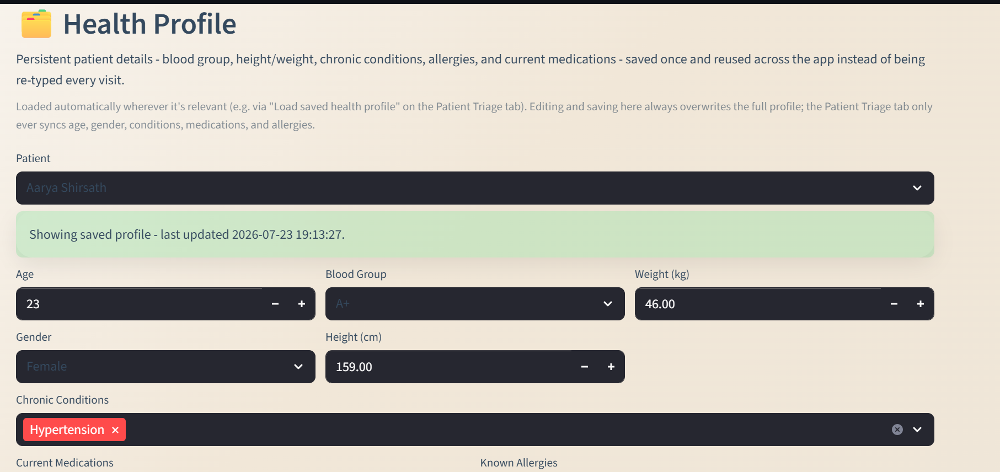
</p>

---

# 📂 Project Structure

```text
mediagent-ai/
│
├── agents/                  # Multi-Agent AI pipeline
│   ├── pipeline.py          #   3-agent Intake → Triage → Recommend chain (production)
│   ├── safety_gate.py       #   deterministic emergency/red-flag overrides
│   └── observability.py     #   per-run latency/status logging
│
├── database/                # Database initialization & schema
│   ├── connection.py        #   single get_connection() / DB_PATH
│   ├── schema.py            #   single source of truth for every table
│   ├── migrations.py        #   idempotent create/backfill, run on every startup
│   └── db.py                #   manual `python -m database.db` entrypoint
│
├── data/                    # SQLite database
│
├── evaluation/               # AI evaluation harnesses (triage + RAG)
│
├── tools/                   # Application modules
│   ├── auth_tools.py
│   ├── appointment_prep_tools.py
│   ├── chat_rag_tools.py
│   ├── drug_checker.py
│   ├── health_profile_tools.py
│   ├── lab_report_tools.py
│   ├── save_case.py
│   └── ...
│
├── screenshots/
├── app.py
├── requirements.txt
├── README.md
└── .env
```

Every table (`users`, `cases`, `health_profile`, `lab_reports`, `lab_values`) is
defined once in `database/schema.py`; `database/migrations.py` creates
whatever's missing and backfills any column an older database doesn't have
yet, without touching existing rows. `app.py` (and each `tools/*.py` module
that touches the DB) calls this on import, so a fresh clone and an
upgraded-in-place deployment both end up with the same schema. See the
top-of-file comment in `database/schema.py` for the one deliberate
limitation this doesn't fix (`patient_name` as the join key rather than a
real `patient_id` foreign key) and why that's left as documented future
work rather than a live-data migration bundled in here.

---

# 🚀 Installation

Clone the repository

```bash
git clone https://github.com/Aarya0706/mediagent-ai.git
```

Navigate into the project

```bash
cd mediagent-ai
```

Install dependencies

```bash
pip install -r requirements.txt
```

Create a `.env` file

```env
# Required
GROQ_API_KEY=YOUR_GROQ_API_KEY

# Optional - both have working defaults, override only if needed
GROQ_MODEL=openai/gpt-oss-20b        # model used by the triage pipeline
PUBMED_CONTACT_EMAIL=you@example.com  # polite identification for NCBI E-utilities (AI Health Chat's PubMed fallback)
```

Run the application

```bash
streamlit run app.py
```

On first run, `database/migrations.py` creates `data/hospital.db` and every table automatically — no manual setup step needed.

---

# ✅ Testing & CI

```bash
pip install -r requirements-dev.txt
pytest tests/ -v      # 55 tests: safety gate, authorization, migrations, RAG retrieval, observability, report/drug services
ruff check . --select E9,F   # same lint check CI runs
```

Every push and pull request runs both automatically via GitHub Actions (`.github/workflows/tests.yml`) — see the badge at the top of this README.

---

# 🎯 Key Highlights

- 🤖 Agentic AI architecture
- 🏥 Multi-Agent clinical decision support
- 🎙️ Voice-to-text symptom entry
- 🔐 Role-based authentication
- 📄 AI-generated PDF reports
- 👨‍⚕️ Doctor workflow management
- 📊 Hospital analytics dashboard
- 🧪 AI lab report interpretation
- 💬 RAG-powered health assistant
- 💊 Drug interaction analysis
- 📅 Appointment preparation
- 🗂️ Persistent health profiles
- ☁️ Streamlit Cloud deployment

---

# 🔮 Future Enhancements

- 🌍 Multilingual support
- 📱 Mobile-responsive interface
- 🏥 HL7/FHIR interoperability
- 📅 Hospital appointment scheduling
- 🔔 Real-time notifications
- 📈 Predictive hospital workload forecasting
- 🧬 Wearable device integration
- 📤 Electronic Health Record (EHR) integration

---

# ⚠️ Disclaimer

**MediAgent AI is intended for educational and research purposes.**

The platform provides AI-assisted clinical decision support and preliminary recommendations. It is **not a substitute for professional medical advice, diagnosis, or treatment**. Patients should always consult qualified healthcare professionals for medical decisions.

---

# 👩‍💻 Author

## Aarya Shirsath

**B.Tech Computer Science & Engineering**  
**VIT Bhopal University**

### Connect with me

- GitHub: https://github.com/Aarya0706
- LinkedIn: https://www.linkedin.com/in/aarya-shirsath-9b7684340/

---

<div align="center">

### ⭐ If you found this project interesting, consider giving it a star!

**Thank you for visiting MediAgent AI ❤️**

</div>